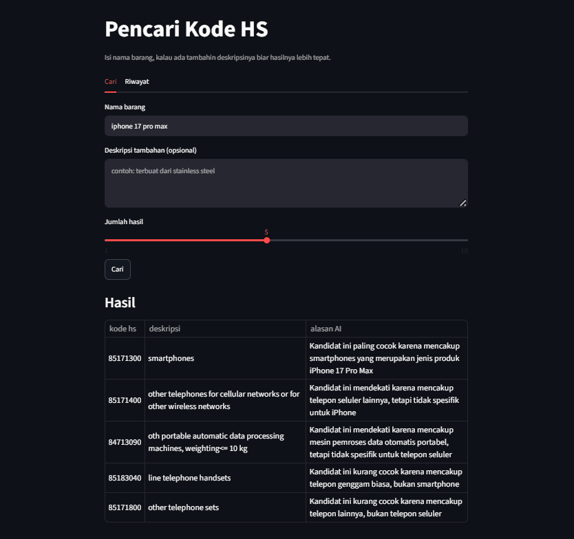
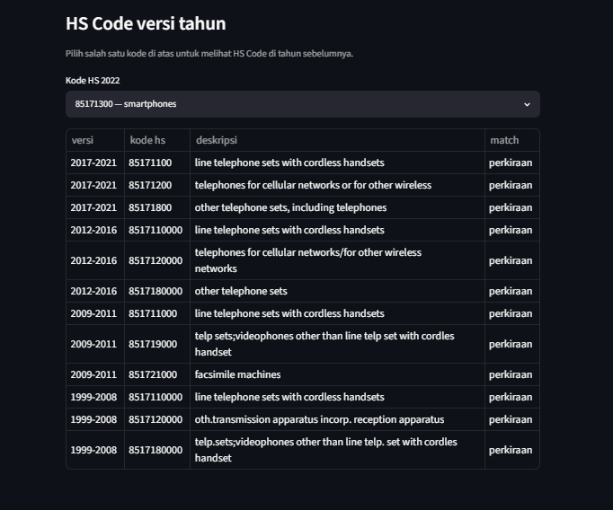

# Pencari Kode HS

Aplikasi untuk mencari kode HS (Harmonized System) 8-digit dari nama barang berbahasa Indonesia menggunakan pendekatan *semantic search*.

Contoh: input `Iphone 17 Pro Max` akan menghasilkan kode `85171300 - cellular telephones including smartphones` beserta alasan mengapa kode tersebut dipilih.

## Fitur

- Mencari kode HS cukup dari nama barang berbahasa Indonesia, tanpa harus tahu istilah teknis atau bahasa Inggrisnya.
- Setiap hasil disertai alasan mengapa kode tersebut direkomendasikan, bukan sekadar daftar kode.
- Crosswalk: menampilkan padanan kode pada versi tahun sebelumnya (2017-2021, 2012-2016, dst).
- Riwayat: seluruh pencarian tersimpan dan dapat dilihat kembali.

## Tampilan




## Latar belakang

Mencari kode HS secara manual cukup merepotkan, terdapat 11.554 kode dengan deskripsi teknis berbahasa Inggris yang banyak saling mirip. Kesalahan memilih kode dapat berakibat pada kesalahan tarif bea masuk hingga barang tertahan di bea cukai. Aplikasi ini membantu menemukan kode yang relevan hanya dari nama barang sehari-hari.

## Cara menjalankan

Install dependency:

```bash
pip install -r requirements.txt
pip install -e .
```

Jika `models/desc_emb.npy` belum ada, buat terlebih dahulu (proses embedding seluruh deskripsi, cukup sekali):

```bash
python scripts/build_index.py
```

Menjalankan backend (FastAPI):

```bash
uvicorn api.main:app --reload
```

Menjalankan frontend (Streamlit) pada terminal terpisah:

```bash
streamlit run app/streamlit_app.py
```

Pada Streamlit, masukkan API key Groq di sidebar terlebih dahulu sebelum melakukan pencarian. Model embedding akan diunduh otomatis saat pertama kali dijalankan (hanya sekali di awal).

## Cara kerja

Pendekatan yang digunakan adalah **retrieve-then-rerank**, bukan klasifikasi. Alasannya, setiap kode HS hanya memiliki 1 deskripsi (1 contoh per kelas) dengan jumlah kelas mencapai 11.554, sehingga tidak cukup untuk melatih model klasifikasi. Berikut alurnya:

1. Query di embedding, lalu dicocokkan ke seluruh deskripsi menggunakan *cosine similarity* (retrieve).
2. Query juga di *expand* menggunakan LLM (misal "meja makan" menjadi "dining table") agar lebih sesuai dengan istilah pada dataset, kemudian dicari kembali. Hasil dua cabang ini digabungkan.
3. Hasil gabungan di *rerank* menggunakan LLM (Llama 3.3 70B), lalu diurutkan berdasarkan tingkat kecocokan sekaligus diberi alasan pada setiap hasil.

Fitur crosswalk berjalan secara deterministik, mencocokkan 6-digit terlebih dahulu, jika tidak ditemukan turun ke 4-digit dengan Jaccard similarity untuk memilih yang paling mirip. Tidak menggunakan model/AI.

## Model & tools

- Embedding: `paraphrase-multilingual-mpnet-base-v2`
- LLM (expand + rerank): Llama 3.3 70B via Groq
- Backend: FastAPI
- Frontend: Streamlit
- Database (riwayat pencarian): SQLite

## Hasil evaluasi

Diuji menggunakan 60 query berbahasa Indonesia (hit-rate@5, level 6-digit):

| Kondisi | hit@5 |
|---|---|
| Embedding saja | 63% |
| + expand + rerank | 87% |

## Struktur folder

```
src/          modul inti (search, expand, rerank, crosswalk, db, config)
api/          FastAPI
app/          Streamlit
scripts/      build_index.py (membuat embedding)
experiments/  evaluasi + test set
notebooks/    EDA
data/         raw (dari BPS) + processed
models/       desc_emb.npy
```

## Dataset
Buku Tarif Kepabeanan Indonesia (BTKI) 2022 dari BPS, 11.554 kode HS 8-digit, masing-masing dengan 1 deskripsi.

## Demo
   [pencari-kode-hs.streamlit.app](https://pencari-kode-hs.streamlit.app)